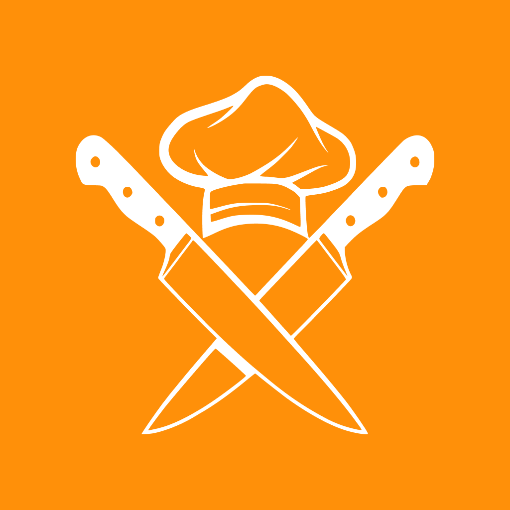

#  Partner In Cook

Project by [__ARCAS__ Manon](https://github.com/Manon-Arc) and [__BARBOTEAU__ Mathieu](https://github.com/Kilecon).

**Partner In Cook** is a cross-platform mobile application utilizing a modern tech stack to help users manage their culinary life. From recipe creation to pantry tracking, it synchronizes data seamlessly across devices using a robust .NET backend.

---

### 📌 Table of Contents

- [About the Project](#-about-the-project)
- [Key Features](#-key-features)
  - [User Features](#user-features)
  - [Technical Features](#technical-features)
- [Tech Stack](#%EF%B8%8F-tech-stack)
- [Architecture](#-architecture)
- [Project Structure](#-project-structure)
- [Getting Started](#-getting-started)

---

### 💡 About the Project

Partner In Cook helps users create, discover, and organize recipes, manage multiple inventories (fridges/pantries), and collaborate with household members. 

Inspired by platforms like Marmiton, it adds a layer of collaborative management:
- **Centralized Data**: Recipes and inventories are stored in a PostgreSQL database.
- **Media Storage**: Images are efficiently handled via Minio S3.
- **Collaboration**: Share recipe lists and manage stock levels in real-time.

---

### 🌟 Key Features

#### User Features
*   **🔐 Authentication**: Secure Email/Password login & onboarding.
*   **📖 Recipe Hub**: Create, edit, and delete rich recipes with photos, steps, ingredients, and tags.
*   **🗄️ Inventory Management**: Manage multiple **Fridges** and **Pantries** to track ingredient quantities.
*   **🤝 Collaboration**: Create and share recipe lists with other users for event planning or households.
*   **🔍 Discovery**: Search and filter recipes to find inspiration.
*   **🔗 Sharing**: Share content easily via QR Codes or deep links.

#### Technical Features
*   **📱 Cross-Platform**: Native performance on iOS and Android (Flutter).
*   **🧠 State Management**: Reactive state management using **GetX**.
*   **⚡ Network Logic**: Robust HTTP client with **Dio** including **caching strategies** (`dio_cache_interceptor`) for offline resilience.
*   **🔗 Deep Linking**: Integrated `app_links` for seamless navigation from external URLs.
*   **💾 Local Persistence**: `shared_preferences` for managing local user session and settings.
*   **🖼️ Media Optimization**: Native image picking and splash screen integration.

---

### ⚙️ Tech Stack

**Mobile Client**
<p>
  
  
  
  
</p>

**Backend Services**
<p>
  
  
  
  
</p>

---

### 📋 Architecture

The application follows a clean architectural pattern to separate UI, business logic, and data.

```plaintext
                 PARTNER IN COOK ECOSYSTEM

    ┌──────────────┐          ┌──────────────────┐
    │  Mobile App  │          │   Backend API    │
    │  (Flutter)   │ ◄──────► │    (.NET 8)      │
    └──────┬───────┘          └────────┬─────────┘
           │                           │
           ▼                           ▼
    ┌──────────────┐          ┌──────────────────┐
    │ Local Cache  │          │    Database      │
    │ (SharedPrefs)│          │   (PostgreSQL)   │
    └──────────────┘          └──────────────────┘
                                       │
                              ┌────────▼─────────┐
                              │  Object Storage  │
                              │     (Minio)      │
                              └──────────────────┘
```

**Mobile Architecture specifics:**
- **Presentation**: Widgets and GetX Controllers.
- **Core**: Essentials like AuthToken handling, formatters, and network clients.
- **Data**: Repositories converting JSON APIs to Dart Models.

---

### 📁 Project Structure

```bash
lib/
├── common/        # Shared configuration & constants
├── component/     # Reusable UI widgets (Fridge, Recipe cards...)
├── core/          # Core features (Auth, DeepLink, Network)
├── data/          # Data sources & Repositories
├── model/         # Data Models
├── presentation/  # Screens & Views
├── routes/        # Navigation Maps
├── services/      # App-level services
└── main.dart      # Entry point
```

---

### 📥 Getting Started

#### Prerequisites
- **OS**: Windows, macOS, or Linux
- **Flutter SDK**: `^3.8.1`
- **IDE**: VS Code or Android Studio

#### Installation

1. **Clone the repository**
   ```bash
   git clone https://github.com/Kilecon/partnerInCook_app.git
   cd partnerInCook_app
   ```

2. **Install Dependencies**
   ```bash
   flutter pub get
   ```

3. **Run the App**
   Connect a device or start an emulator, then run:
   ```bash
   flutter run
   ```

---

> Developed with ❤️ by the **Partner In Cook** team.
